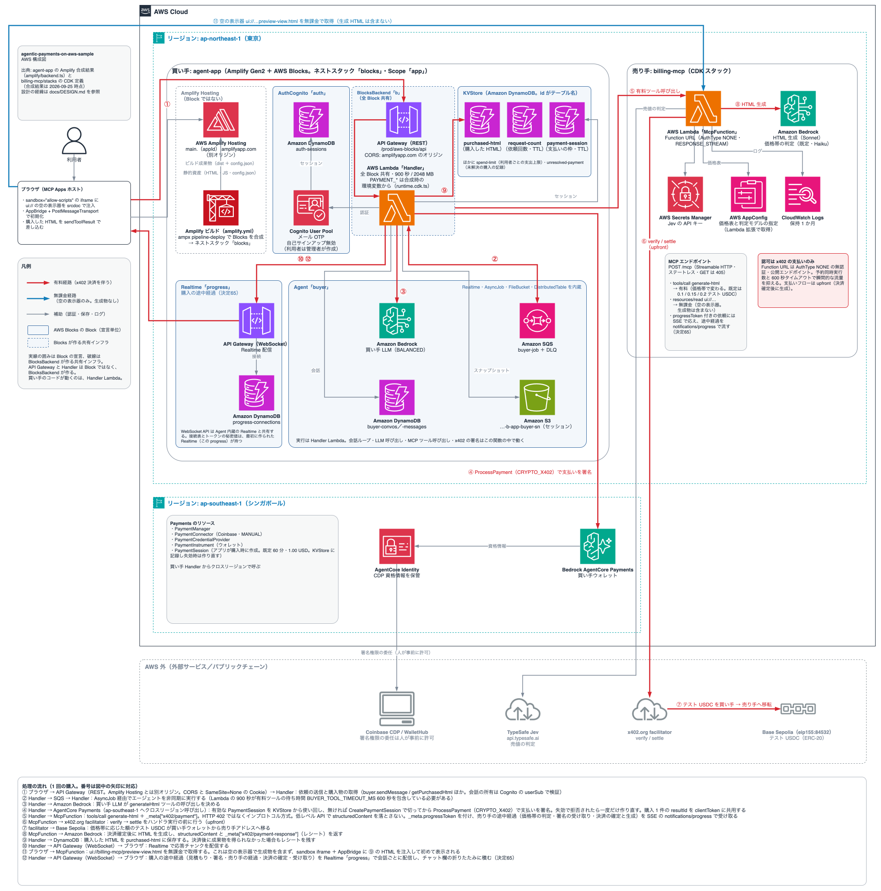

# agentic-payments-on-aws-sample

ブラウザで「こんなページを作って」と頼むと、AI エージェントが有料のツールを見つけ出し、
テスト USDC で支払いを済ませてから呼び出し、できあがったページを画面に表示します。
支払いのたびに人が承認する必要はなく、最初にウォレットへ署名権限を委ねておくだけで済みます。

AWS 上にこの一連の流れを組んだサンプルです。
実際にやり取りされるのはテストネットのテスト USDC だけで、本物のお金は使いません。

## 何が起きるか

1 回の購入では、次の流れで処理が進みます。

1. ブラウザから依頼を送る
2. 買い手のエージェント（Amazon Bedrock）が、売り手の `generate-html` という有料ツールを使うと決める
3. 売り手が依頼の内容から作るべきページの規模を判定し、梅・竹・松のいずれかの価格を根拠つきで返す
   （「ご依頼の内容では、およそ 8000 トークン相当の分量のページになります。このため竹（$0.15）でのご提供です」）
4. エージェントがウォレットで支払いに署名し、支払い証明を添えてツールを呼び直す
5. 売り手は決済の確定を見届けてから、判定した価格帯の規模に合わせて HTML を生成して返す
6. ブラウザは、あらかじめ売り手から無料で受け取っていた空の画面に完成したページを流し込み、表示する

この間の途中経過（売り手の判定・署名・決済の確定・生成の待ち時間）は、チャット欄の折りたたみに随時流れます（決定65）。

売り手のエンドポイントに認証はありません。
決済の仕組みだけで、決済を済ませた相手にだけツールを使わせるのがこのサンプルの狙いです。

価格が呼び出しごとに変わるのは、生成の原価が依頼によって 4 倍ほど開くためです。
ただし依頼文から実際の出力量は予測できないと実測で分かったため、売り手は予測するのではなく、
判定した価格帯の規模を生成の指示に織り込んで原価のほうを決めています（docs/DESIGN.md 決定56）。

上の図は、買い手・売り手の両方をクラウドに置いたときの構成です。draw.io で開けばそのまま編集できます。

## 使っている技術

| | |
| --- | --- |
| x402 | HTTP の 402 Payment Required を土台にした決済プロトコル（Coinbase 発）。リクエスト 1 回ごとに支払いを検証・決済する。事前の契約も API キーも不要なのが特徴 |
| MCP / MCP Apps | Model Context Protocol は、エージェントにツールを使わせるための規格。MCP Apps はその拡張で、ツールに画面（HTML UI）を添えて配布できる |
| AgentCore Payments | Amazon Bedrock AgentCore のマネージドウォレット。エージェントに代わって支払いへ署名する。人は最初に一度、署名権限を委ねるだけでよい |
| AWS Blocks | インフラをコードで定義するフレームワーク。買い手のアプリはこれを使って書いている |
| Amplify Gen2 | 買い手アプリをクラウドにデプロイする仕組み。AWS Blocks のスタックをネストして載せ、フロントは Amplify Hosting が配信する。git push でデプロイできる |
| AWS CDK | 売り手のインフラをコードで定義する。TypeScript で書いたスタックを合成してデプロイする |
| Lambda Function URL | 売り手の MCP サーバーの置き場。認証は付けず、x402 の支払いだけが認可を担う |

## 動かす

### 前提

- AWS アカウント。Amazon Bedrock のモデルを ap-northeast-1 で有効化しておく
- AWS Marketplace で Coinbase のサブスクリプションに加入する（AgentCore Payments のコネクタに要る）
- Coinbase Developer Platform の API キーとウォレットシークレット
- Node 24 / pnpm 10（`mise install` で入る）

### 手順

売り手 → 買い手の順に起動します。詳しい手順と選択肢は、それぞれの README にあります。

1. 売り手を起動する（[billing-mcp/README.md](billing-mcp/README.md)）

   ローカルであれば `pnpm dev` を実行するだけで、ポート 8000 で起動します。
   クラウドに出す場合は `pnpm cdk deploy` を使いますが、
   これは無認証の公開エンドポイントをインターネット上に公開する操作です。
   価格と同時実行数の設定を確認してから実行し、使い終わったら `pnpm cdk destroy` で閉じてください。

2. 買い手のウォレットを用意する（[agent-app/README.md](agent-app/README.md)）

   `npx tsx scripts/payments-setup.ts` を実行するとウォレットが作成され、WalletHub の URL が表示されます。
   そのページを開いて署名権限を委任してください。人が操作するのはここだけで、委任には有効期限があります。
   続けて `npx tsx scripts/faucet.ts <アドレス>` を実行し、テスト USDC を入金します。

3. 買い手を起動する

   `payments-setup.ts` の出力である `PAYMENT_*` と、売り手の URL（`BILLING_MCP_URL`）を環境変数として渡し、
   `npm run dev` を実行します。ポート 3000 で起動します。

> ブラウザから依頼を送ると、実際にオンチェーンの決済（テスト USDC）が発生します。

## ディレクトリ構成

| ディレクトリ | 中身 |
| --- | --- |
| `billing-mcp/` | 売り手。x402 で課金する MCP Apps サーバーと、それを Lambda へ載せる CDK |
| `agent-app/` | 買い手。支払って MCP を実行するエージェントと、操作・表示を行う Web アプリ |
| `docs/` | 設計決定録・実装記録・考察・AWS 構成図 |

## ステータス

作りかけのサンプルで、動くところと手つかずのところがあります。

- 売り手: 実装・デプロイまで完了。クラウド上の Lambda に対して実オンチェーン決済が通ることを確認済み。
  価格帯の判定は既定で Bedrock の Haiku を使い、AWS AppConfig の設定で TypeSafe の Jev へ
  切り替えられる（再デプロイ不要。両者の精度に有意差は見られず、既定を替える決め手は無かった）
- 買い手: 上の「何が起きるか」を、ローカルとクラウドの双方で確認済み。途中経過の表示は、ローカルでは実決済で確認済み。
  クラウドには deploy 済みだが、実決済での確認はまだ
- 利用者ごとの制限: 支払いの枠と依頼の回数をサインインした利用者ごとに掛けている
  （詳細は agent-app/README.md 参照）
- 手つかず: 決済後に成果物を受け取れなかった買い手を救う仕組み（返金に相当するもの）と、
  支払いの枠を切る権限と支払う権限のロール分離

## もっと詳しく

このサンプルは、結論だけでなく判断に至った経緯を残すことも目的にしています。

- [docs/DESIGN.md](docs/DESIGN.md) — 設計判断とその理由を番号付きで記録した決定録。
  この README で触れている「決定N」はここを指します
- [docs/implementation-log.md](docs/implementation-log.md) — 日付ごとの作業記録。
  何につまずき、どう判断したかの詳細
- [docs/agentcore-payments-considerations.md](docs/agentcore-payments-considerations.md) — AgentCore Payments の
  制限が何をしてくれて何をしてくれないか、制限をどこまで掛けるべきかの考察
- [CLAUDE.md](CLAUDE.md) / [agent-app/AGENTS.md](agent-app/AGENTS.md) — AI エージェントに作業させるための規約

## 参考リポジトリ

- 機能の踏襲元: [k-ibaraki/html-creator-mcp-apps](https://github.com/k-ibaraki/html-creator-mcp-apps)
- CDK の作り・開発規約の参考: [k-ibaraki/ops-agent-sample-on-aws](https://github.com/k-ibaraki/ops-agent-sample-on-aws)
- AWS Blocks の参考: [k-ibaraki/handson-aws-blocks](https://github.com/k-ibaraki/handson-aws-blocks)

## ライセンス

[MIT](LICENSE)
